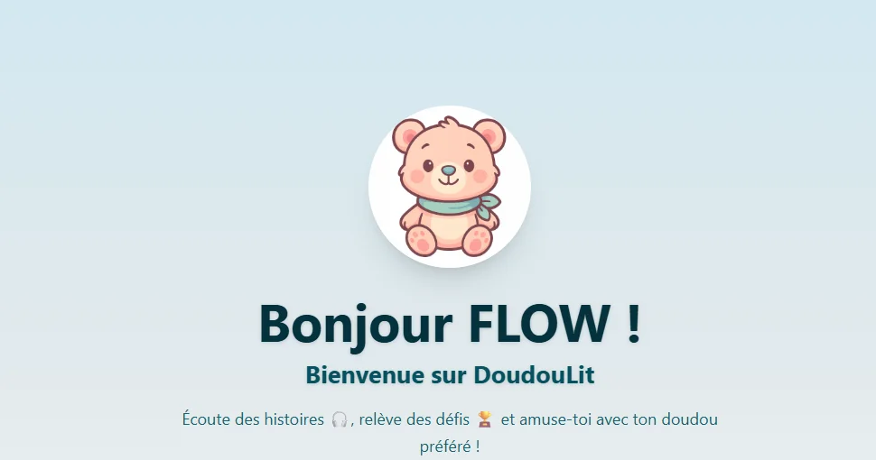
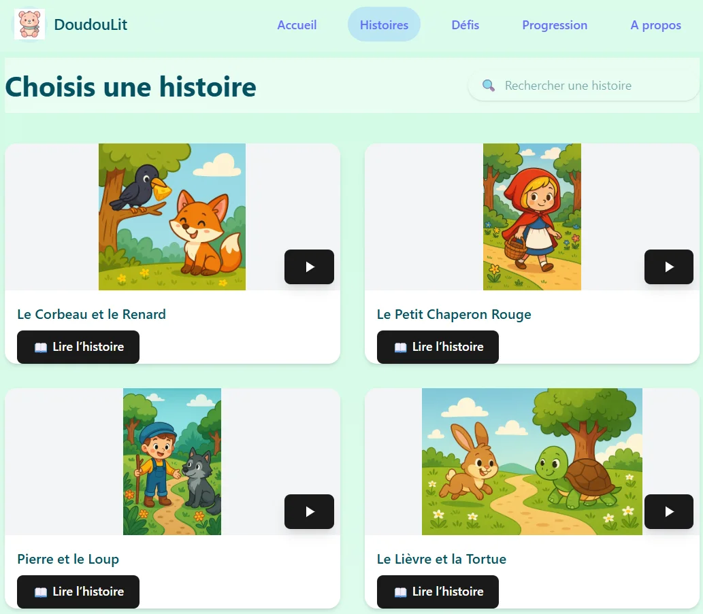
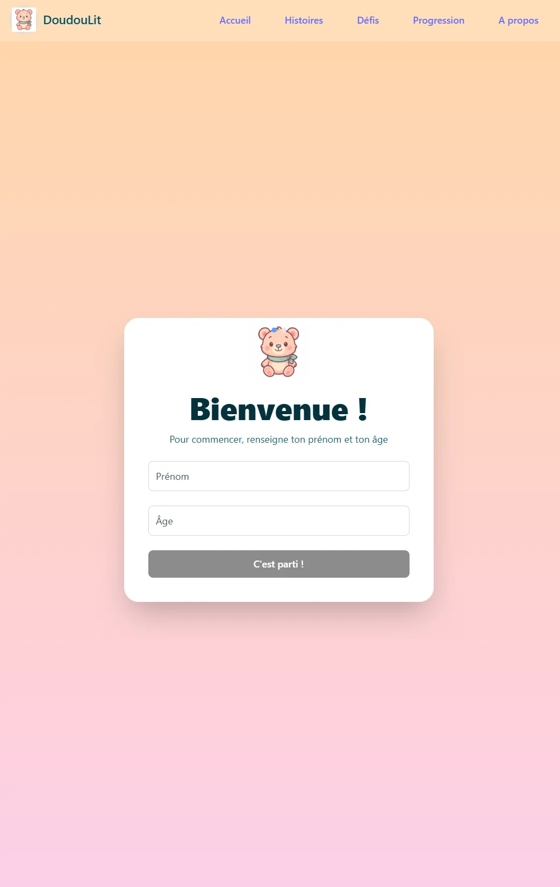
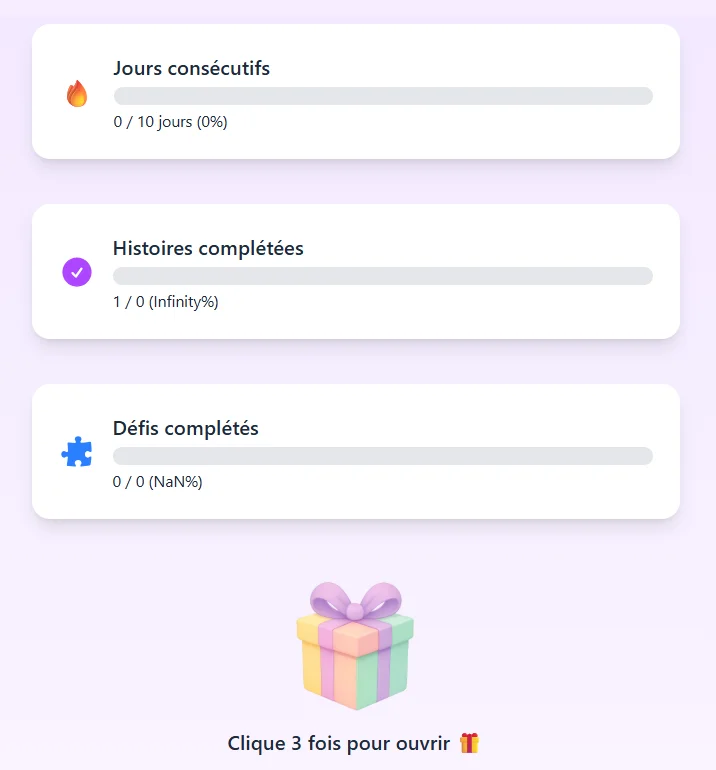

# 🧸 DoudouLit

> ⚠️ Ce dépôt est une **page vitrine**.  
> Le code source de DoudouLit est privé ; ce README présente la vision produit, l'UX et l'architecture technique du projet.

> **Une expérience éducative douce qui transforme le temps d'écran du soir en moment d'apprentissage.**  
> Histoires audio – Défis pédagogiques – Progression ludique

***

## 🌟 Le concept

**DoudouLit** réinvente le moment du coucher en **expérience interactive et bienveillante** pour les enfants de 3 à 10 ans.  
J'ai conçu ce projet comme une application full-stack pour explorer la création d'un rituel du soir calme, éducatif et visuellement apaisant.

Dans un contexte où le temps d'écran inquiète les parents, DoudouLit propose une alternative **intelligente et apaisante** :
- 🎧 Histoires audio narrées avec douceur  
- 🎯 Défis pédagogiques légers après les histoires  
- 💖 Ambiance bienveillante qui rassure et inspire  
- 📊 Suivi de progression avec jauges visuelles, sans logique compétitive  


***

## 💡 Philosophie : les 5 piliers

| Pilier | Signification | Dans DoudouLit |
|------|-------------|---------------|
| 🎮 **Ludique** | Apprendre en s'amusant | Gamification douce, mascotte attachante, micro-animations |
| 🧠 **Intelligent** | Contenu adapté à l'âge | Histoires ciblées 3-10 ans, défis progressifs |
| 📚 **Pédagogique** | Enrichir sans contraindre | Vocabulaire enrichi, morales positives |
| 🌙 **Calme** | Apaiser avant le sommeil | Palette pastel, animations douces |
| 💖 **Bienveillant** | Encourager sans juger | Jauges positives, pas de scores négatifs |

***

## 📸 Aperçu de l'interface

### 🏠 Accueil personnalisé


L'enfant est accueilli par une mascotte douce et rassurante, avec une interface personnalisée et un univers visuel apaisant, conçu pour instaurer un rituel du soir calme et sécurisant.

***

### 📖 Bibliothèque d'histoires


Une bibliothèque illustrée de contes adaptés à l'âge de l'enfant, avec audio et texte affiché pour favoriser l'écoute, la lecture autonome des plus grands et la lecture accompagnée avec le parent.

***

### 🚀 Onboarding enfant


Un parcours d'entrée simple et ludique permettant à l'enfant (avec l'aide du parent) de découvrir l'application sans surcharge cognitive ni écrans intrusifs.

***

### 📊 Progression & jauges encourageantes


Des jauges visuelles positives permettent de suivre l'évolution de l'enfant sans logique compétitive, sans pénalité, et avec des encouragements constants.

***

## 🧩 Pages & parcours

### 🏠 Page d'accueil
- Personnalisation immédiate (prénom de l'enfant)  
- Design pastel non-stimulant  
- Animations subtiles et rassurantes  
- Navigation intuitive adaptée aux jeunes enfants  

***

### 📖 Page Histoires
**Catalogue prototype :**
- 🦊 Le Corbeau et le Renard (5-8 ans)  
- 🔴 Le Petit Chaperon Rouge (3-6 ans)  
- 🐺 Pierre et le Loup (4-8 ans)  
- 🐢 Le Lièvre et la Tortue (4-7 ans)  

**Fonctionnalités :**
- Recherche par titre  
- Filtres par âge et durée  
- Lecteur audio intégré  
- Texte intégral affiché  

***

### 🧩 Page Défis
**Mini-jeux et quiz courts visant :**
- Compréhension de l'histoire  
- Reconnaissance des émotions  
- Expression orale  
- Apprentissage par le jeu  

***

### 📊 Page Progression
**Statistiques affichées :**
- **Continuité d'utilisation** (indicateur souple, sans objectif chiffré imposé)  
- Histoires complétées  
- Défis réalisés  
- Récompenses symboliques  

**Approche :**
- Aucune comparaison entre enfants  
- Aucune pénalité  
- Encouragements constants  

***

## 🎨 Identité visuelle & UX

### Palette de couleurs

```css
--primary: #f6ad55;      /* Orange doux */
--secondary: #fbb6ce;    /* Rose pastel */
--accent: #68d391;       /* Vert menthe */
--bg-main: #f0f9ff;      /* Bleu très clair */
```

### Principes UX

- Boutons larges et lisibles, adaptés aux enfants  
- Animations légères pour un feedback rassurant  
- Aucun dark pattern ni mécanique manipulatrice  
- Aucune publicité  
- Contrôle parental prévu (temps d'écoute, paramètres)

***

## 🏗️ Architecture technique

### Stack technologique

- **Frontend** : React 18 + TypeScript  
- **Styling** : TailwindCSS  
- **Animations** : Framer Motion  
- **State management** : Zustand  
- **Routing** : React Router v6  
- **Backend** : FastAPI  
- **Base de données** : SQLModel (SQLite / PostgreSQL)  
- **Audio** : HTML5 Audio API  

### Frontend

```
frontend-react/
└── src/
    ├── pages/         # Pages principales
    ├── components/    # Composants réutilisables
    ├── store/         # State management
    └── assets/        # Images, sons, illustrations
```

### Backend

```
backend/
└── app/
    ├── models/        # Modèles de données
    ├── routers/       # Routes API
    └── core/          # Configuration & base de données
```

***

## 🎯 Fonctionnalités

### ✅ Implémenté

- Accueil personnalisé  
- Bibliothèque d'histoires  
- Lecteur audio  
- Défis éducatifs  
- Suivi de progression visuel  
- API REST  
- Base de données persistante  

### 🚧 En développement

- Authentification parentale  
- Profils enfants multiples  
- Mode nuit automatique  
- Lecture audio synchronisée (texte + voix)  
- Application mobile  

***

## 💡 Principes pédagogiques

- Contenu enrichi et adapté à l'âge de l'enfant  
- Morales positives (entraide, respect, persévérance)  
- Pas de violence gratuite dans les récits  
- Apprentissage sans pression ni notation négative  
- Respect du rythme et de l'attention de l'enfant  

***

## 📜 Crédits & licence

**Création** : Florence Jaymes  
**Rôles** : conception produit, UX/UI, développement frontend & backend  

Licence **propriétaire** — toute réutilisation du code, des écrans ou de la marque nécessite un accord écrit préalable.

***

## 📞 Contact

- 📧 **Email** : florence.jaymes@gmail.com  
- 💼 **LinkedIn** : https://www.linkedin.com/in/florence-jaymes  
- 🐙 **GitHub** : https://github.com/flow3flow  

***

<div align="center">

### ✨ *"Transformer chaque histoire en moment magique"* ✨

**Fait avec 💖 par Florence Jaymes**

</div>